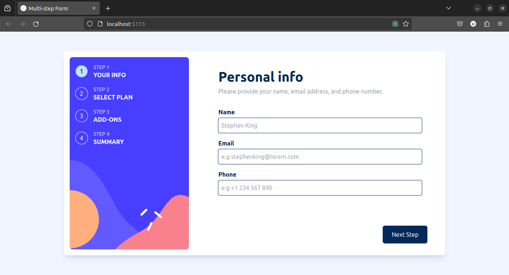
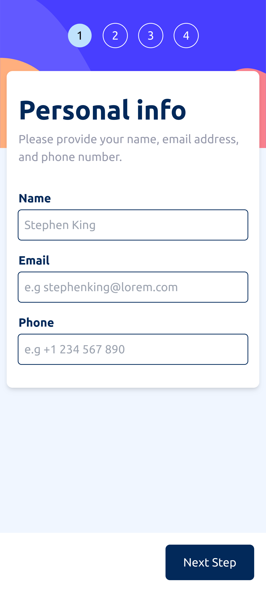

# Frontend Mentor - Multi-step form solution

This is a solution to the [Multi-step form challenge on Frontend Mentor](https://www.frontendmentor.io/challenges/multistep-form-YVAnSdqQBJ). Frontend Mentor challenges help you improve your coding skills by building realistic projects.

## Progress

**Almost complete**.

All that is left is:

- Adding the Ubuntu font to the project. I forgot to do this since I am developing the project on Ubuntu 22.04 LTS where Ubuntu is (not surprisinlgy) the default font.

## Table of contents

- [Overview](#overview)
  - [The challenge](#the-challenge)
  - [Screenshots](#screenshots)
  - [Links](#links)
- [My process](#my-process)
  - [Built with](#built-with)
  - [What I learned](#what-i-learned)
  - [Continued development](#continued-development)
  - [Useful resources](#useful-resources)
- [Author](#author)
- [Acknowledgments](#acknowledgments)

## Overview

### The challenge

Users should be able to:

- Complete each step of the sequence
- Go back to a previous step to update their selections
- See a summary of their selections on the final step and confirm their order
- View the optimal layout for the interface depending on their device's screen size
- See hover and focus states for all interactive elements on the page
- Receive form validation messages if:
  - A field has been missed
  - The email address is not formatted correctly
  - A step is submitted, but no selection has been made

### Screenshots

#### Desktop Screenshot

#### Mobile Screenshot

### Links

Deployed application - https://multistep-form-redux.vercel.app/

## My process

I was learning about [React Hook Form]() for a different project. In their [Advanced Usage]() section of the React Hook Form documentation, they talk of a strategy to create wizard-like (multi-step) forms that involves using a routing library and a state management library. (They use [React Router]() and [LittleStateMachine]() for their demo). This bit of documentation reminded me of this Frontend Mentor challenge and gave me a lot of what I needed to tackle this project.

In essence, it inspired me to come back to this project. I had tried this project around a year before and I had abandoned it completely.

As I was already familiar with React Router and I was learning [Redux](), I used them in the project for routing and state management respectively. Of course, I used React Hook Form for form validation.

I begun development with a bare minimum version of the UI of each step without styling so that I could focus on state management and form validation.

Afterwards, I continued working on the desktop layout of the application. Although this worked out in the end, it made working on the mobile version quite cumbersome. This is so as Tailwind CSS supports a mobile-first approach. Fighthing the framework made changes that I was supposed to make for mobile only affect the already established desktop desing.

The design was quite involving, but I think I did a decent job on it.

The final step is to match the colours of the design to each element. (Where I am now)

### Built with

- Semantic HTML5 markup
- Flexbox
- CSS Grid
- Tailwind CSS
- Desktop-first workflow
- [TypeScript]()
- [React](https://reactjs.org/) - JS library
- [Redux](https://reduxjs.org) - State management library

### What I learned

- State management using Redux and [Redux Toolkit](). I think Redux was a bit much for this project though.
  A better option would have been to use LitteStateMachine or some other light-weight state management library. Or better yet, just plain React state management using [context](), [providers]() and [useReducer](). I may redo this project (or a similar one) using the React-only approach in the future.

- Form validation using React Hook Form.

- Non-trivial responsive styling using Tailwind CSS.

- That I can complete a project categorized as **advanced** on Frontend Mentor.

### Continued development

I would like to practice Redux and Redux Toolkit on more projects (especially using it in asynchronous contexts). This project served as a great starting point, but as I mentioned before, I think Redux was a bit much for it.

I also would like to learn how to write tests for React application using [React Testing Library]() and [Jest](). I did not include tests in this roject, but it is something I am hoping to add to my toolkit in subsequent projects.

### Useful resources

- [MDN Article on advanced form styling]() - This was a great reference for the properties I needed to use to style the checkboxes used in step 3 (The add-ons section).
- [MDN Article on custom form controls]() - I was considering creating the Monthly-Yearly switch as a custom form control, but I ultimately decided against it. This can be a good resource if you are willing to do it (or are just curious about custom form controls).
- [Tailwind CSS Documentation]() - This served as a great reference throughout the project
- [Using Redux with TypeScript]() - This resource helped me integrate Redux with TypeScript. It showed me the types that I had to add, the modifications to how I exported Redux hooks, e.t.c.

## Author

- Frontend Mentor - [@Mirror83](https://www.frontendmentor.io/profile/Mirror83)
- Twitter - [@glenochieng](https://www.twitter.com/glen_ochieng_)
